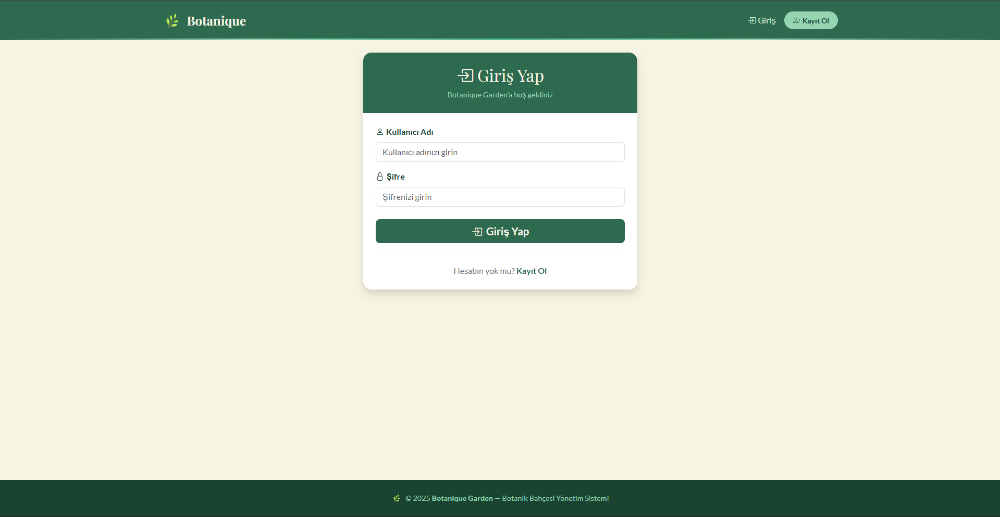
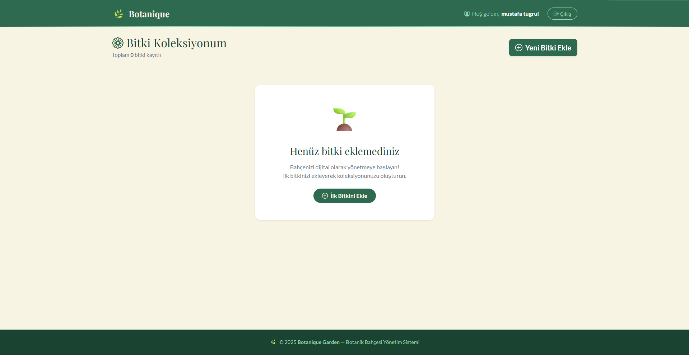
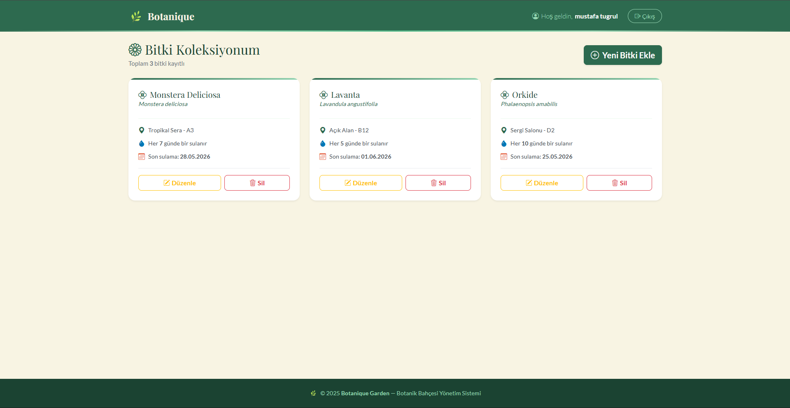

# 🌿 Botanique Garden - Botanik Bahçesi Yönetim Sistemi

Botanique Garden, bitkilerinizi kolayca yönetebileceğiniz, takip edebileceğiniz ve yeni bitkiler ekleyebileceğiniz bir Botanik Bahçesi Yönetim Sistemidir. Bu proje, kullanıcı doğrulama ve tam kapsamlı CRUD (Create, Read, Update, Delete) operasyonlarını içerir.

**🌍 Canlı Demo:** [http://95.130.171.20/~st23360859010/](http://95.130.171.20/~st23360859010/)

## 🚀 Özellikler

Proje aşağıdaki temel gereksinimleri tam olarak karşılamaktadır:

- **Kullanıcı Kaydı:** Yeni kullanıcıların sisteme kayıt olabilmesi.
- **Oturum Açma/Kapama:** Güvenli kullanıcı girişi ve çıkışı.
- **Bilgi Girişi (Create):** Kullanıcıların sisteme yeni bitki ekleyebilmesi.
- **Bilgilerin Listelenmesi (Read):** Eklenen tüm bitkilerin ana sayfada listelenmesi.
- **Bilgi Güncelleme (Update):** Mevcut bitki bilgilerinin düzenlenebilmesi.
- **Bilgi Silme (Delete):** İstenmeyen bitki kayıtlarının sistemden silinmesi.
- **Modern Tasarım:** Arayüz **Bootstrap 5** CSS kütüphanesi kullanılarak geliştirilmiştir.

## 🛠️ Kullanılan Teknolojiler

- **Backend:** PHP (PDO ile güvenli veritabanı işlemleri)
- **Frontend:** HTML5, CSS3, Bootstrap 5
- **Veritabanı:** MySQL
- **Mimari:** Vanilla PHP, Singleton Database Pattern

## 📸 Ekran Görüntüleri

*Kullanıcıların sisteme giriş yapabilmesi için güvenli login ekranı.*
  

*Yeni kayıt olan bir kullanıcının karşılaştığı, henüz bitki eklenmemiş boş ana sayfa.*
  

*Kullanıcının bitkilerini ekledikten sonra oluşan listeleme (Read) ve yönetim ekranı.*

## 🎥 Proje Tanıtım Videosu

Projenin tüm fonksiyonlarını ve kullanımını anlatan tanıtım videosunu aşağıdan izleyebilirsiniz:

[👉 Tanıtım Videosunu İzlemek İçin Tıklayın](BURAYA_LINK_GELECEK)

## ⚙️ Kurulum ve Çalıştırma (Lokal Ortam)

Projeyi kendi bilgisayarınızda çalıştırmak için aşağıdaki adımları takip edebilirsiniz:

1. Bu projeyi bilgisayarınıza indirin veya klonlayın.
2. XAMPP/WAMP/MAMP gibi bir yerel sunucu ortamının `htdocs` (veya `www`) klasörüne dosyaları atın.
3. phpMyAdmin üzerinden `botanique_garden` adında yeni bir veritabanı oluşturun.
4. `config/db.example.php` dosyasını referans alarak `config/db.php` dosyasını oluşturun ve kendi veritabanı bilgilerinizi (kullanıcı adı, şifre) girin.
5. Tarayıcınızda `http://localhost/botanique-garden/` adresine giderek uygulamayı başlatın.

## 🌐 Canlıya Alma (Hosting)

Projeyi bir web sunucusuna yüklediğinizde, `config/db.php` dosyası içerisindeki veritabanı adını, kullanıcı adını ve şifresini hosting sağlayıcınızın size verdiği uzak veritabanı (MySQL) bilgileriyle değiştirmeyi unutmayın.

---
*Bu proje web programlama dersi değerlendirme kriterlerine uygun olarak geliştirilmiştir.*
